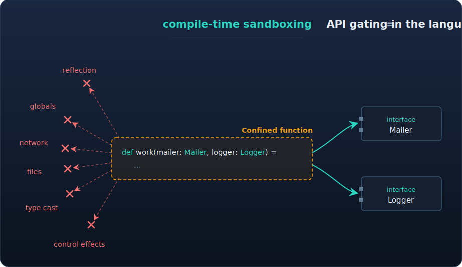

<div align="center">
  <picture>
    <source media="(prefers-color-scheme: dark)" srcset="./docs/img/logo.svg">
    <source media="(prefers-color-scheme: light)" srcset="./docs/img/logo-black.svg">
    
  </picture>

  <p>For the joy of secure programming</p>

  [](https://github.com/typescope/jo/actions/workflows/ci.yml)
  [](https://github.com/typescope/jo/releases/tag/v0.11.3)
  [](LICENSE)
  [](https://jo-lang.org)
</div>

---

Jo is a statically typed language that enables **compile-time sandboxing**. Instead of confining a running program from the outside, Jo proves — before the code runs — that it can only use the capabilities it was explicitly granted. Jo compiles to Ruby and Python.

> **Project status:** Early-stage. The compiler, standard library, and toolchain are ready for serious experimentation. APIs and language details may still change.

## Why compile-time sandboxing?

AI agents now generate code that runs inside your platform. That code can — unless you stop it — reach for the network, read arbitrary files, or query other users' data.

The usual defense is a **runtime sandbox**: a container, VM, or seccomp filter that wraps the running program and polices it from the outside. But runtime sandboxes operate at the *wrong level*. They can block a syscall or a filesystem path, but they cannot express "access only *this* user's rows" — that is application logic, invisible to the OS.

Jo moves the sandbox into the type system. A capability a function never received is one it cannot use, and the compiler proves this transitively across the entire call graph — before the program runs. The boundary is visible right in the code, there is nothing to escape at runtime, and "only this user's data" becomes an ordinary, checkable type.

<div align="center">
  
</div>

Function parameters (capabilities) are the only door to the outside world.

## Language Highlights

### Static capability control

```scala
def foo() = println "foo"                     // inferred capability: stdout
def bar() = foo()                              // inferred capability: stdout

def qux() receives IO.stdout = println "qux" // explicit: only stdout

def main =
  allow none in bar()                         // error: no capabilities allowed
  allow IO.stdout in bar()                    // OK
  with IO.stdout = s => pass in qux()         // redirect output
```

```
---------- Error at main.jo:5:3 ---------------
|   allow none in bar()
|                 ^^^^^
|   Parameter not allowed: stdout

The following is the trace that leads to the problem:
├──   allow none in bar()     [ main.jo:5:3 ]
│                   ^^^^^
├── def bar() = foo()         [ main.jo:2:13 ]
│               ^^^^^
└── def foo() = println "foo" [ main.jo:1:13 ]
                ^^^^^^^
```

### Pattern-oriented programming

Named, reusable pattern predicates compose with logical operators:

```scala
pattern Positive: Partial[Int] = case x if x > 0

match list
case [..positives while Positive, ..rest] =>
  println "pos = \{positives}, rest = \{rest}"

case _ => pass

if result is Some(code) && code > 0 then
  println "Success, code = \{code}"

// enable option "s" to allow . to match new line
if message is `(?s)<code>(?<prog>.*)</code>` then
  println prog
```

## Confining AI-Generated Code

The two-world architecture separates confined code (no FFI, checked against capability interfaces only) from trusted code (FFI allowed, implements and provides capabilities):

```scala
//--- Interface library (confined, no FFI) ---
param ordersApi: OrdersApi
defer def aiMain(): Unit receives ordersApi, IO.stdout

//--- Framework harness (trusted, FFI allowed) ---
def frameworkMain() =
  val db = connect("orders.db")
  val userId = currentUser()
  val restricted = new UserScopedOrders(userId, db)  // attenuated: user-scoped, read-only
  val buffer = (s: String) => output += s

  allow none in
    with ordersApi = restricted, IO.stdout = buffer in aiMain()

//--- AI-generated code (confined, no FFI) ---
def aiMain(): Unit receives ordersApi, IO.stdout =
  val orders = ordersApi.query(30)
  printOrders: orders.select(o => o.state == "open")
```

`allow none` is a compile-time proof: `aiMain()` uses no capabilities beyond what it declared. The AI code cannot access the network, filesystem, or other users' data.

See the [security documentation](https://jo-lang.org/security/security-problem) for the full model.

## Try Jo

```bash
curl -sSf https://jo-lang.org/install.sh | sh
```

The installer downloads the compiler to `~/.jo/compilers/<version>/` and creates a launcher at `~/.local/bin/jo`. Add `~/.local/bin` to `PATH` if it is not already there.

Full installation instructions and a getting-started guide are at **[jo-lang.org](https://jo-lang.org)**.

## Theoretical Foundations

Jo's capability model is grounded in `λCC`, a formally verified calculus of
[contextual capabilities](https://github.com/typescope/contextual-capability).
`λCC` provides a mathematical account of static capability tracking and the proof
is mechanized in Coq.

## Learn More

<table>
  <tr>
    <td><a href="https://jo-lang.org/overview/language-tour">Language Tour</a></td>
    <td>Overview of Jo's features with examples</td>
  </tr>
  <tr>
    <td><a href="https://jo-lang.org/security/two-worlds">Security Model</a></td>
    <td>How capability enforcement works</td>
  </tr>
  <tr>
    <td><a href="https://jo-lang.org/language/design-principles">Language Reference</a></td>
    <td>Types, expressions, patterns, definitions</td>
  </tr>
  <tr>
    <td><a href="https://jo-lang.org/usage/getting-started">Build Tool</a></td>
    <td>Project setup, dependencies, commands</td>
  </tr>
</table>

## Contributing

See [CONTRIBUTING.md](CONTRIBUTING.md) for build instructions, contribution guidelines, and the DCO sign-off requirement. Bug reports, language design discussions, and pull requests are welcome.

Security issues should be reported privately — see [SECURITY.md](SECURITY.md).

## License

Apache 2.0 — see [LICENSE](LICENSE).

Jo is developed and maintained by [TypeScope](https://typescope.ai).
