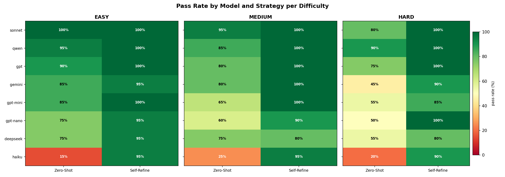
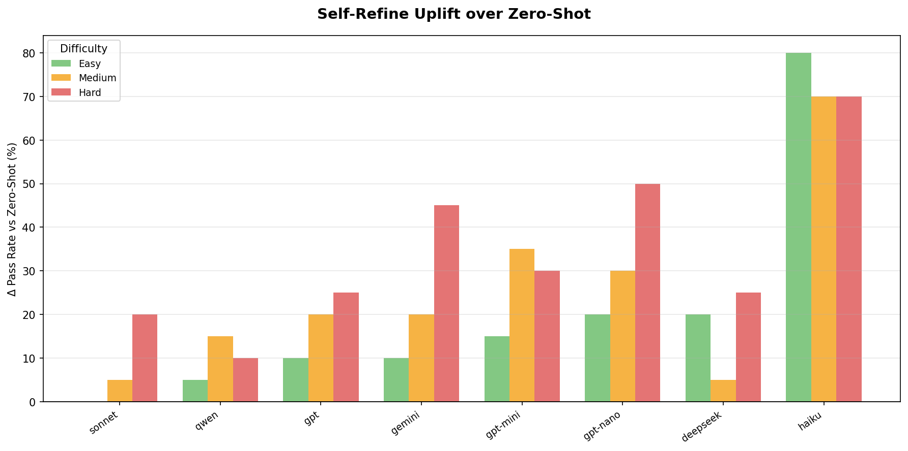
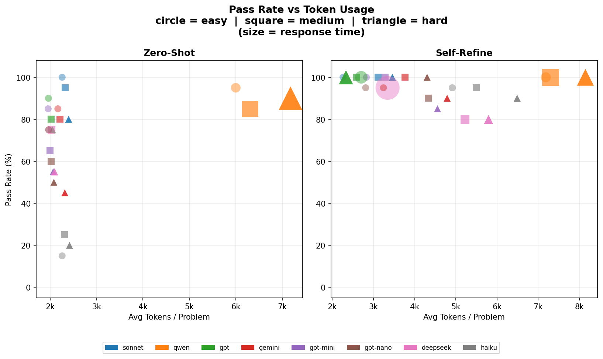
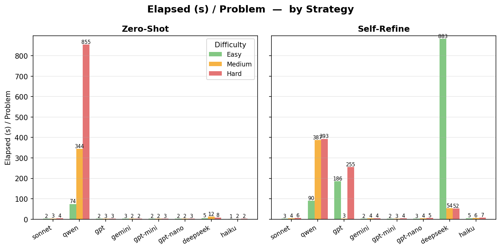
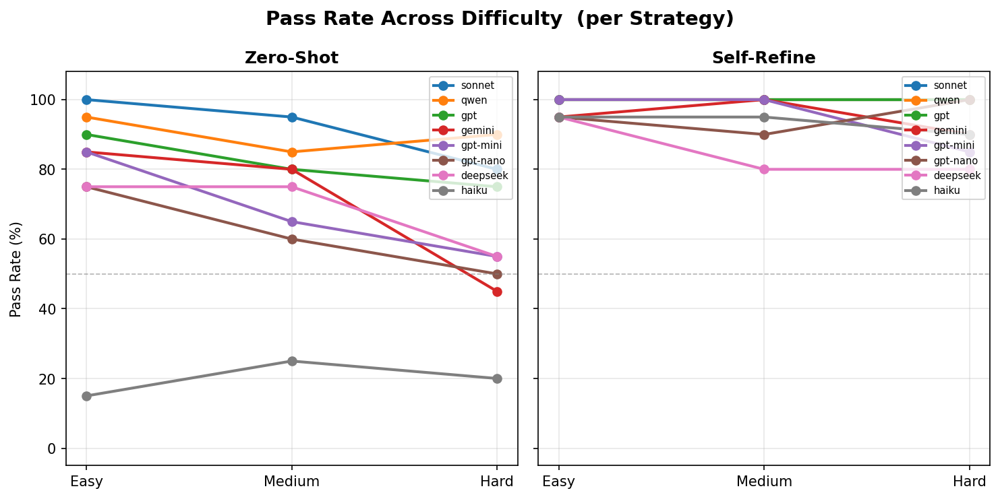
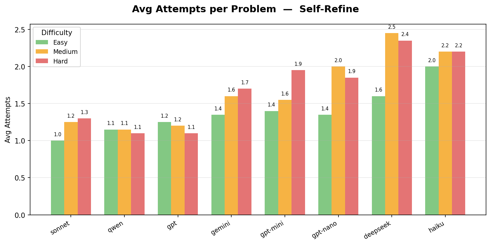
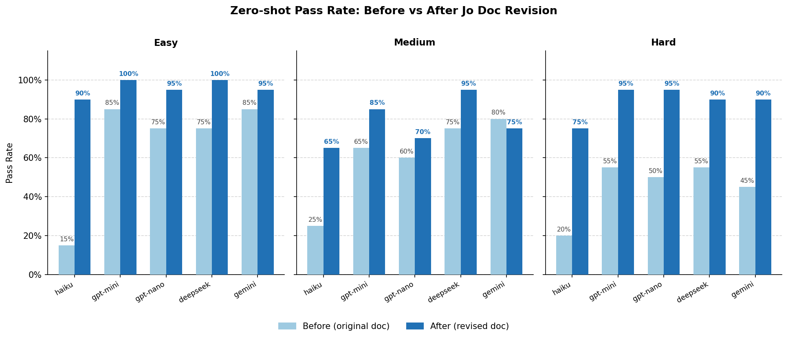

# Can LLMs Write Code in a Language They've Never Seen?
**Benchmarking 8 frontier models on Jo, a newly designed programming language**

## 1. Introduction

Since [HumanEval](https://arxiv.org/abs/2107.03374) started code generating evaluation on large language models (LLMs), many benchmarks have been proposed to evaluate LLMs from different coding task scenarios. [MBPP](https://arxiv.org/pdf/2108.07732) evaluates how well LLMs can generate short Python programs from natural language descriptions. [SWE-bench](https://arxiv.org/pdf/2310.06770) assesses the ability of LLMs to tackle real-world software issues sourced from GitHub. These benchmarks all target the `python` language. Some have accuracies approaching 100% ([human eval](https://llm-stats.com/benchmarks/humaneval), [mbpp](https://llm-stats.com/benchmarks/mbpp)).

Recently, [EsoLang-Bench](https://esolang-bench.vercel.app/) tested LLMs on esoteric programming languages. In contrast, the best score from frontier models is only around 3.8%. The languages used in `EsoLang-Bench` are not real, but intentionally created as a proof of concept. It will be interesting to see how LLMs perform on a genuine new programming language, what kind of issues the models will encounter and how we can make them achieve better accuracy.

Jo is a newly designed programming language. It is statically typed, functional, and indentation-based. It shares syntax similarities with other languages but has many different features and programming patterns.

In this research, we evaluate the coding capability of LLMs on `Jo`. We compare accuracy and efficiency between different models using two distinct agent strategies. We also analyze common error patterns from failed problems and verify impact of improved language syntax prompt on LLMs' accuracy.

## 2. Benchmark Setup

We use three (easy, medium, and hard) algorithmic problem sets from [EsoLang-Bench](https://esolang-bench.vercel.app/) for testing. Two agent strategies (zero-shot and self-refine) are tested for each model on each problem set. `Zero-shot` strategy provides models with a simple Jo syntax document as initial prompt. Each model can only attempt a solution once per problem — pass or fail, no retry. `Self-refine` strategy extends zero-shot by allowing the model to iterate on failure using the compiler or runtime error output. The maximum number of attempts per problem is set to 5.

We choose 8 frontier coding models to test: Claude Sonnet(4.6), Claude Haiku(4.5), GPT(5.4), GPT-mini(5.4), GPT-nano(5.4), Gemini(3-flash-preview), Qwen(3.6-plus), Deepseek(v3.2). GPT models are served via the OpenAI platform. Sonnet and haiku are run through the Anthropic API. For easy access, all other models are routed via [OpenRouter](https://openrouter.ai/).

The benchmark source code, testing data, and report analysis files are hosted in the agent [benchmark](https://github.com/typescope/agent-bench) repository. The testing source code is easily extensible to add a new agent, model or language for future research.

## 3. Overall Results

The pass rate is calculated from dividing the number of correctly solved problems by total problems in a set. The rate drops smoothly from top to bottom in ranking order. Haiku is an outlier, scoring only around 20% on zero-shot. We will analyze the primary failures on Haiku in later sections.

Strategy is a major factor impacting pass rate. Under zero-shot strategy, mid-tier models like GPT-mini, GPT-nano, and Gemini score only ~50% on the hard problem set, self-refine pushes that to above 85%.

Token efficiency broadly aligns with the pass rate rankings, averaging between 2k and 2.5k tokens per problem per attempt, with Sonnet and GPT being most efficient and Qwen the least. 

Latency is roughly on par except GPT with self-refine strategy. Self-refine has higher average latency due to multiple attempts. Qwen and DeepSeek are clear outliers. Their abnormality is likely caused by rate limit thresholds on the serving platforms in Asia.

## 4. The Self-Refine Effect

**Self-refine resolves most of the failures encountered under zero-shot** This effect is universal across all models, although there's noticeable difference between models. E.g., DeepSeek only resolves about 50% of the failures. 

| Model | Zero-shot failures | Fixed by self-refine | Still failing |
|---|---|---|---|
| haiku | 48 | 44 | 4 |
| sonnet | 5 | 5 | 0 |
| deepseek | 20 | 11 | 9 |
| gemini | 18 | 15 | 3 |
| gpt | 11 | 11 | 0 |
| gpt-mini | 19 | 16 | 3 |
| gpt-nano | 23 | 20 | 3 |
| qwen | 6 | 6 | 0 |

**Pass rate does not fall across difficulty levels** This is consistent with the observation that most failures are resolved with self-refine. Under zero-shot, pass rate generally drops from easy to hard problem set.

**Average retry is 2 times** Although there's maximum 5 attempts under self-refine, average attempts per problem only range from 1 to 2.5 across models, meaning most problems are resolved by the second attempt.

## 5. Failure Analysis

We examined all result logs and categorized failure errors into 7 patterns. The table below counts the number of errors exhibiting each pattern per model. A single problem may have multiple failure errors, so column sums exceed total problem failures. `Runtime Error` is caused by compiler crashes when compiling the generated solution. Since it's compiler related, we ignored it in following analysis.

| Pattern | sonnet | haiku | deepseek | gemini | gpt | gpt-mini | gpt-nano | qwen |
|---|---:|---:|---:|---:|---:|---:|---:|---:|
| **Total failures** | **5** | **48** | **20** | **18** | **11** | **19** | **23** | **6** |
| A: Array/String API | 1 | 7 | 11 | 0 | 3 | 9 | 5 | 1 |
| B: List API misuse | 2 | 6 | 5 | 3 | 1 | 6 | 7 | 0 |
| C: Map/Set API issues | 2 | 12 | 4 | 6 | 4 | 3 | 9 | 2 |
| D: Type system assumptions | 0 | 2 | 2 | 6 | 1 | 1 | 2 | 1 |
| E: Invalid syntax | 2 | 39 | 4 | 8 | 5 | 7 | 9 | 3 |
| F: Misleading doc | 1 | 2 | 1 | 0 | 2 | 0 | 0 | 0 |
| Runtime Error | 1 | 2 | 3 | 3 | 4 | 3 | 3 | 1 |

Key observations:
- **Pattern E dominates haiku** — 39 of 48 haiku failures include a Pattern E error; 37 of those trace to a single missing `import jo.IO.*`.
- **Pattern A (Array/String methods) is the most widespread** — DeepSeek leads at 11, GPT-mini at 9; absent string methods (`.drop`, `.reverse`, `.toUpperCase`) are the single most recurring source across all models.
- **Pattern C (Map/Set API) is broadly distributed** — haiku tops at 12 (mostly `var x = {}` init ambiguity); GPT-nano at 9; every mid-tier model is affected.
- **Pattern B (List API) hits mid-tier models hardest** — GPT-nano 7; haiku 6; GPT-mini 6; DeepSeek 5; untyped empty list `var x = []` and index-based mutation are the main sub-patterns.
- **Pattern D (type system assumptions) is Gemini's signature** — 6 problems, concentrated in null checks, union leading pipe, and void-return mismatches; Gemini transfers more type-system assumptions from other languages.
- **Pattern F (misleading doc) impact is limited** — Most models can handle well with slightly inaccurate documentation. Only 6 total instances, all traceable to two erroneous places in the document (constructor example and map `.get()` return type). 

## 6. Testing with revised Jo prompt document

Based on the failure analysis, we revised the initial Jo prompt syntax document. Using the new document, we retested the five mid-tier models.

### Changes on the syntax document

We created a new syntax prompt [document](/docs/jo-revised.txt) based on [existing one](/docs/jo.txt) by making the following changes:

**1. Add `import jo.IO.*` to every example that uses I/O** *(Pattern E)*
37 of haiku's 48 zero-shot failures are caused by a missing import, and the same issue appears in gpt-nano.

**2. Fix existing doc errors** *(Pattern F)*
- Class Constructor : the doc shows `val p = Point(1, 2)`. Add `new` explicitly and a note clarifying that class instantiation always requires `new`.
- Map: clarify `get` returns `T`, `getOpt` returns `Option[T]` type.

**3. String API update** *(Pattern A)*
Explicitly states `.drop()`, `.take()`, `.reverse()` are not supported. Add other methods like `toLower`, `toUpper`, `substring`.

**4. Collection immutability and initialization** *(Patterns B, C)*
- Callout all standard collections (List, Map, Set, String) are immutable. Show the correct `var list = list ++ [x]` update pattern.
- Add typed initialization examples for all empty collections: `List[Int]`, `Map[String, Int]`, `Set[String]`.

**5. Null value and No-op** *(Patterns A, D)*
Add section to callout Jo's way of representing empty value and no operation.

### Result

The accuracy of all five models improved with the revised prompt document. The chart below compares zero-shot pass rate before and after the doc revision across all difficulty levels.

**Haiku's improvement confirmed.** Haiku's zero-shot pass rate increased from ~20% to 77%.

**Hard problems benefit most.** Every model improved most sharply on hard problems: gpt-mini +40%, gpt-nano +45%, deepseek +35%, gemini +45%. The revised doc's additions on collection immutability, typed empty init, and null/no-op semantics directly address the Map/Set-heavy logic that hard problems rely on.

**Medium problems are the remaining weak spot.** Gemini regressed slightly (80%→75%); haiku made the smallest gain (25%→65%). Medium problems continue to surface List equality, tuple destructuring, and pattern matching syntax issues — gaps the revised doc did not address.

### Error Delta

The table compares error pattern numbers for the five models before and after the doc revision. OLD counts use the multi-pattern classification from section 5 (a single failure may carry multiple tags); NEW counts use primary-pattern classification from the revised doc runs.

| Pattern | OLD | NEW | Change |
|---|---:|---:|---:|
| A: Array/String API | 32 | 24 | −8 |
| B: List API misuse | 27 | 0 | −27 |
| C: Map/Set API issues | 34 | 0 | −34 |
| D: Type system assumptions | 13 | 12 | −1 |
| E: Invalid syntax | 67 | 16 | −51 |
| F: Misleading doc | 3 | 0 | −3 |
| Runtime error | 14 | 5 | −9 |

- **Pattern E dropped 76%** (67→16) — driven almost entirely by adding `import jo.IO.*` to doc examples, eliminating haiku's 37 failures.
- **Patterns B and C fully eliminated** — the collection immutability callout and typed empty-collection examples resolved all List/Map/Set API confusion across the models.
- **Pattern A remains stubbornly present** (32→24, −25%) — models still call methods absent from Jo's stdlib (`isDigit()`, `entries()`, `foldWithIndex()`, `Array.fill()`).
- **Pattern D mostly unchanged** (13→12) — type system misunderstandings (`==` on `List[Char]`, Char arithmetic returning `Int`) persist and were not addressed by the revision.

## 7. Conclusion

Frontier models can effectively solve coding problems in the newly designed language `Jo` with simple syntax prompt, but the efficiency and accuracy vary across models and agent testing strategies.

**Self-refine bridges the gap between tiers.** Under zero-shot, mid-tier models score only ~50% on hard problems; self-refine pushes that above 85%, narrowing the gap with top models. 

**Failures expose where models are stuck.** Models transfer collection and string idioms from Scala, Java, or Python. Some fail heavily on type-system assumptions; others spread failures broadly across syntax, API, and logic.

**Documentation quality has asymmetric leverage.** The revised prompt yielded 35% to 45% gains on hard problems across models, and eliminated entire categories of collection-related failures. However, failures persisted in absent standard library knowledge and deeply ingrained type-system assumptions from other languages.

## Appendix: Detailed Error

The following patterns are drawn from inspecting all failed `results.jsonl` entries and their compiler error logs across both zero-shot and self-refine runs.

**Pattern A: Missing or wrong API methods**
- Non-existent collection types: `Array.fill(n)(true)`, `Queue`, `Stack`, `StringBuilder`
    - Models apply the Scala/Java mental model when no Jo equivalent is documented
    - deepseek, gpt-mini, gpt-nano; most common on hard problems involving mutable data structures (sieves, BFS)
- Non-existent String methods: `.drop()`, `.take()`, `.map()`, `.reverse()`, `.toUpperCase()`, `.toLowerCase()`, `.substring(i, j)`, `.charAt(i)`
    - Jo's String API is minimal; `.drop()` is the single most frequently called absent method
    - haiku, sonnet, deepseek, gpt, gpt-mini, gpt-nano, qwen
- Non-existent Char method: `x.code` — correct form is `x.toInt`
    - haiku, gpt-nano

**Pattern B: List API misuse**
- Equality check: `listA == listB` — no equality method defined on List in Jo
    - haiku, gemini, qwen
- Untyped empty list: `var newCounts = []`
    - Jo requires an explicit type annotation, e.g. `var newCounts: List[Int] = []`
    - haiku, gemini, gpt-mini, gpt-nano
- Wrong `map` signature: `counts.map((idx, v) => ...)`
    - Jo's `map` takes a single-element function; index-value pairs are not supported
    - sonnet, gpt-nano
- Index-based mutation: `counts[d] = counts[d] + 1`
    - All standard collections (List, Map, Set, String) are immutable in Jo
    - gpt-mini, gpt-nano
- Incorrect append: `xs = xs + [item]` instead of `xs = xs ++ [item]`
    - `+` and `++` are documented separately; models conflate them
    - gpt-nano

**Pattern C: Map and Set API issues**
- Empty map init ambiguity: `var counts = {}`
    - Jo cannot infer Map vs Set from `{}`; requires explicit typed init
    - haiku, sonnet, gpt-mini
- Map equality: `m1 == m2` — equality not defined on Map in Jo
    - deepseek, gpt
- Non-existent Set methods: `.fromList()` and `.toList()`
    - deepseek, gpt-nano

**Pattern D: Type system assumption errors**
- Char/Int return mismatch: arithmetic on `Char` yields `Int`, but function expects `Char`
    - models miss the required cast back to `Char`
    - gpt-nano
- Union type leading pipe: `union Token = | Number(...) | Plus`
    - Direct transfer from OCaml/F#/Haskell; Jo omits the leading `|`
    - deepseek; occasionally on other models with ADT-heavy problems
- Tuple destructuring: `val (value, _) = f(...)`
    - Tuples are not supported in Jo; use named fields or separate vals
    - haiku
- Null checks: `if line != null then`
    - Jo has no `null`; the idiomatic form uses `Option`
    - gemini
- Void return: `while true do` inside a function expecting `Int`
    - The loop body has no expression type to return; causes a type error
    - gpt-mini, gpt-nano

**Pattern E: Invalid syntax**
- Missing `import jo.IO.*`
    - Required for `stdin` and `println`; omitting it causes unresolved name errors at compile time
    - Largest single failure source: accounts for 37 of haiku's 48 zero-shot failures
    - haiku, gpt-nano
- For-loop syntax: `for i = 0 to s.length() - 1 do` — invalid in Jo [deepseek]
- Extension definition: `extension (str: String)` — incorrect syntax [deepseek]
- `let` binding: Jo uses `val`, not `let` [gpt-nano]
- Reserved keyword as identifier: `var match = true` — `match` is reserved [qwen]
- C-style block comments: `/** ... */` — Jo uses `//` only [gemini]
- C-style boolean operators: `||`, `&&` — not valid in Jo [gpt]
- Multi-condition expression: `if c == '+' or c == '-'` — `or` is not a valid boolean operator [gpt-nano]
- Unit/no-op: `()` used as a do-nothing value (valid in Scala/Haskell) — Jo uses `pass` [gemini, gpt-nano]
- If/else alignment: misaligned `else` branch causes parse errors [gpt]

**Pattern F: Misleading Jo doc example**
- Models write `A()` to instantiate a class instead of `new A()`
    - The Jo doc example `val p = Point(1, 2)` misleads models into omitting `new`
    - haiku, deepseek, qwen
- Incorrect map method `.get()` return type
    - doc implies `map.get()` returns `Option[Int]`; in fact Jo returns the value directly, causing a type error on unwrapping
    - haiku, gpt

## References

1. [EsoLang-Bench: Evaluating Genuine Reasoning in Large Language Models via Esoteric Programming Languages](https://arxiv.org/pdf/2603.09678)
2. [HumanEval: Evaluating Large Language Models Trained on Code](https://arxiv.org/abs/2107.03374)
3. [MBPP: Mostly Basic Python Problems Benchmark](https://arxiv.org/abs/2108.07732)
4. [EsoLang-Bench Problem Set](https://esolang-bench.vercel.app/)
5. [SWE-Bench](https://arxiv.org/abs/2310.06770)