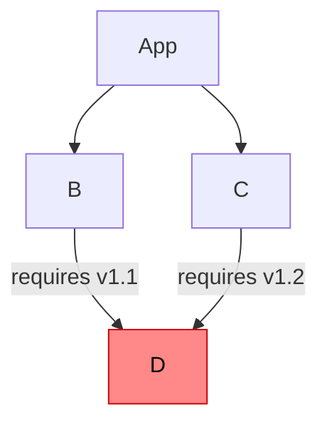

# Dependency Depth

## Problem

Deep dependency trees are a common source of [dependency hell](https://en.wikipedia.org/wiki/Dependency_hell) — a condition where resolving version conflicts across transitive dependencies becomes a significant maintenance burden.

A well-known manifestation is the **diamond dependency problem**: when two libraries B and C both depend on library D but require incompatible versions, the resolver must select one version — potentially breaking either B or C. The deeper the dependency tree, the higher the probability of such conflicts, and the more difficult they are to trace.

<div style="text-align: center">



</div>

Beyond version conflicts, deep trees introduce:

- **Security exposure** — vulnerabilities in packages not explicitly selected as dependencies
- **Reduced auditability** — transitive dependencies are difficult to review and verify
- **Cascading failures** — removal or breakage of a transitive dependency can affect unrelated dependents

## Solution

Jo makes dependency depth **visible and intentional**. Every package declares the maximum depth it allows. Adding dependencies requires an explicit opt-in, recorded in the build spec and visible in code review.

Zero-dependency libraries are the default. They are easier to audit, more portable, and simpler to compose — properties that make them reliable building blocks for larger systems.

## How It Works

The depth of a package is the maximum depth of its dependencies plus one. Leaf packages (no dependencies) have depth 0.

Each build spec declares a `depth` — the maximum allowed depth among its dependencies. `jo build` errors if any dependency's actual depth exceeds the declared value.

| Build kind | Default `depth` |
|------------|-----------------|
| Library    | `0` — no dependencies by default |
| App        | `1` — may depend on depth-0 libraries |

Higher depths are permitted by raising the value explicitly. The defaults ensure that any increase in dependency complexity is a deliberate decision.

## Examples

A depth-0 library — no dependencies:

```toml
[package]
name    = "mustache"
version = "1.0.0"
# depth = 0 (default)
```

A depth-1 library — depends on depth-0 libraries:

```toml
[package]
name    = "agent-api"
version = "1.0.0"
depth   = 1
```

An app using a depth-1 library — raises its own depth to accommodate the full tree:

```toml
[main]
target = "python"
depth  = 2
```
